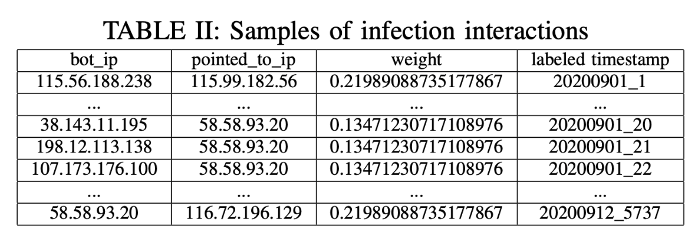

# Input

A txt file, each line indicates a P2P botnet infection interaction, following is a example:

 
    
If you want to use this dataset, please download it from https://github.com/6XvdCwF9/DICN
